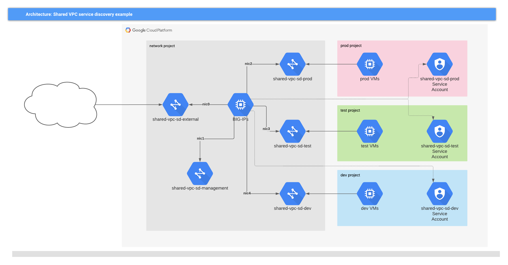
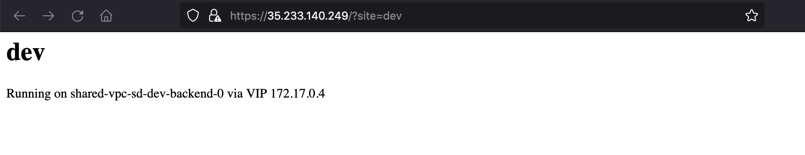
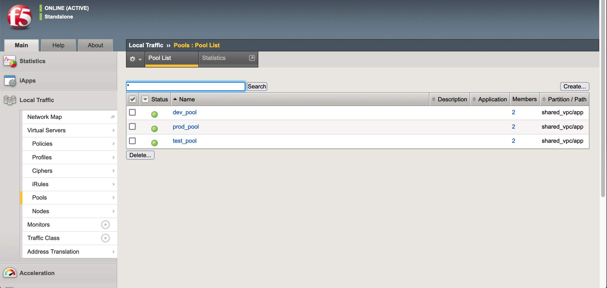
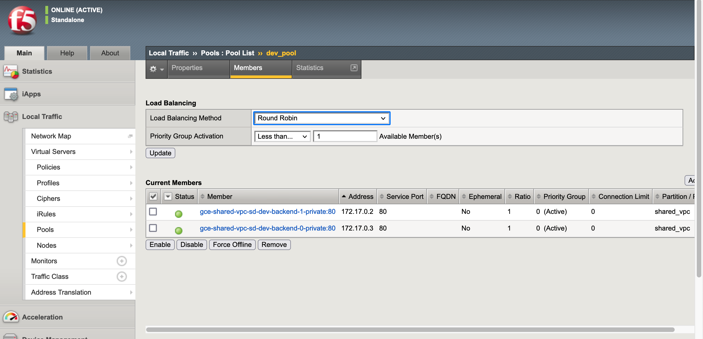
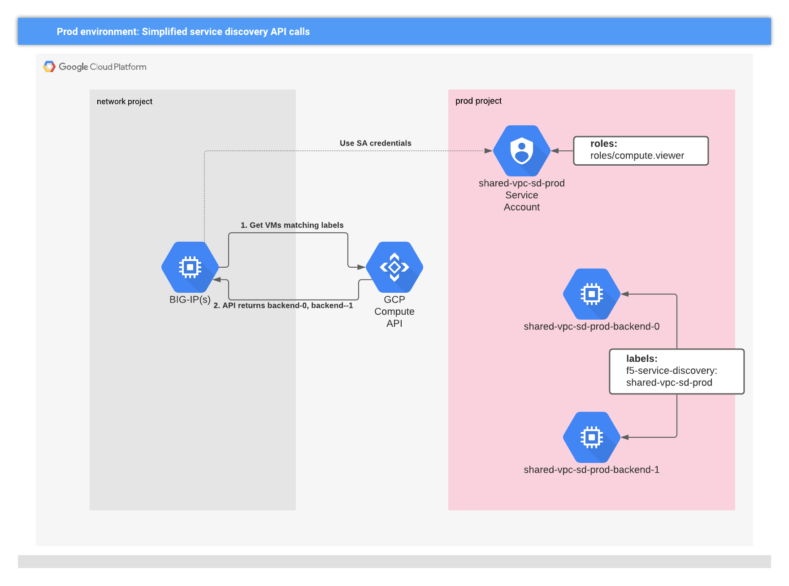
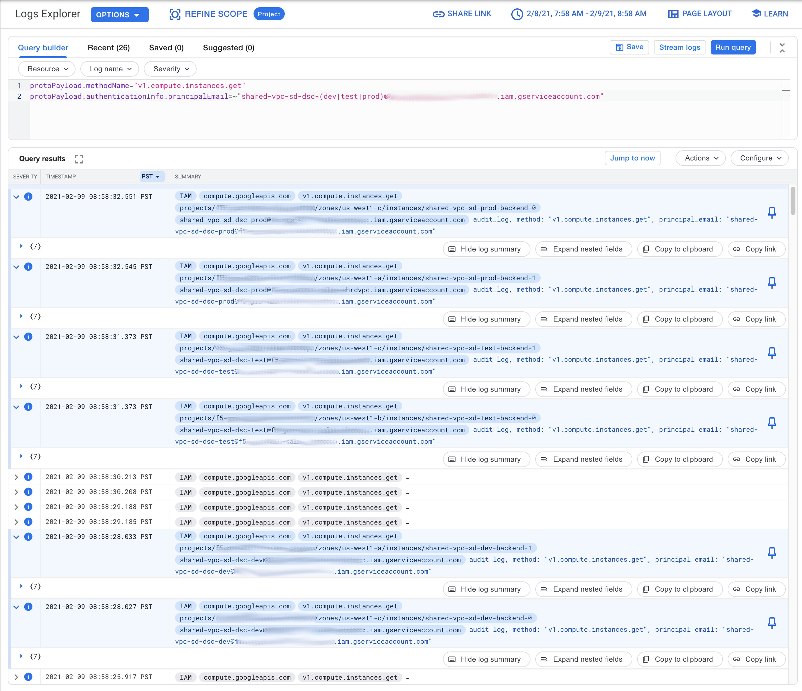

# BIG-IP Service Discovery with multiple GCP projects

## Overview

This repo can be used to show how BIG-IP AS3
[Service Discovery](https://clouddocs.f5.com/products/extensions/f5-appsvcs-extension/latest/declarations/discovery.html)
can locate resources that are deployed in GCP projects other than the project
where BIG-IP is deployed. This is a common scenario when BIG-IP is deployed to a
Shared VPC Host project, and must dynamically populate server pools with
resources deployed to Shared VPC Service projects.



> Figure 1: Shared VPC deployment

## Getting Started

<!-- spell-checker: ignore tfvars -->
1. Create a tfvars file; `terraform.tfvars.example` can be used as a starting point

   ```hcl
   shared_vpc_host_project_id = "<network project>"
   environments = {
     prod = {
       service_project_id = "<prod project>"
     },
     test = {
       service_project_id = "<test project>"
     },
     dev = {
       service_project_id = "<dev project>"
     },
   }
   ```

2. Create the resources through Terraform

   ```shell
   terraform init
   terraform apply -auto-approve
   ```

   ```text
   ...
   Apply complete! Resources: 58 added, 0 changed, 0 destroyed.

   Outputs:

   external = tolist([
     "35.233.140.249",
   ])
   management = tolist([
     "35.230.126.99",
   ])
   ```

3. Clean-up

   When testing is complete, the resources can be destroyed through Terraform.

   ```shell
   terraform destroy -auto-approve
   ```

## Usage

Running Terraform and allowing BIG-IP to complete on-boarding takes a few minutes;
I suggest that you wait 8-10 minutes before performing these steps.

The AS3 declaration adds an [Endpoint_Policy](https://clouddocs.f5.com/products/extensions/f5-appsvcs-extension/latest/refguide/schema-reference.html#endpoint-policy) that directs incoming HTTP requests to a backend pool by matching the request
query string against the environment names.

E.g. Figure 2 shows the content from DEV environment by using a query string
of `?site=dev` to the BIG-IP external public address.



> Figure 2: Gorgeous content served from DEV pool

### Pools and service discovery

This repo deploys BIG-IP with an [AS3 Declaration](https://clouddocs.f5.com/products/extensions/f5-appsvcs-extension/latest/) that creates virtual services and pools
that BIG-IP will use to satisfy incoming requests. The pools are defined without
traditional members; instead [Service Discovery](https://clouddocs.f5.com/products/extensions/f5-appsvcs-extension/latest/declarations/discovery.html) is enabled
to find matching VMs based on `labels`.

```json
"dev_pool": {
  "class": "Pool",
  "monitors": [
    "http"
  ],
  "members": [
    {
      "servicePort": 80,
      "addressDiscovery": "gce",
      "updateInterval": 5,
      "tagKey": "f5-service-discovery",
      "tagValue": "shared-vpc-sd-dev",
      "addressRealm": "private",
      "region": "us-west1",
      "encodedCredentials": "REDACTED BASE64 SA JSON"
    }
  ]
}
```

> NOTE: service discovery uses the field names `tagKey` and `tagLabel` for
> consistency across cloud providers; in GCP these must correlate to VM *label*
> key and value, not network tags.



> Figure 3: BIG-IP virtual service pools declared by AS3

So, to recap, the pools are statically declared in AS3...



> Figure 4: Members of DEV pool discovered by querying GCP Compute API

but the membership of the pools comes from querying the GCP Compute API.

#### How BIG-IP service discovery works on GCP



> Figure 5: BIG-IP queries Compute API for matching resources in Service project

When Service Discovery is enabled on the BIG-IP it will periodically issue Google
Compute API requests to find the current set of VMs that match the requested
labels, and update the pool membership with the private addresses of those
instances.



> Figure 6: GCP audit log showing API requests to get backend instances from Shared VPC Service projects

If you enable `data read` auditing on the Compute API, the requests from BIG-IP
can be monitored and reviewed in Cloud Operations Logging, as shown in Figure 6.

## Support

For support, please open a GitHub issue.  Note, the code in this repository is community supported and is not supported by F5 Networks.  For a complete list of supported projects please reference [SUPPORT.md](SUPPORT.md).

## Community Code of Conduct

Please refer to the [F5 DevCentral Community Code of Conduct](code_of_conduct.md).

## License

[Apache License 2.0](LICENSE)

## Copyright

Copyright 2021 F5 Networks, Inc.

### F5 Networks Contributor License Agreement

Before you start contributing to any project sponsored by F5 Networks, Inc. (F5) on GitHub, you will need to sign a Contributor License Agreement (CLA).

If you are signing as an individual, we recommend that you talk to your employer (if applicable) before signing the CLA since some employment agreements may have restrictions on your contributions to other projects.
Otherwise by submitting a CLA you represent that you are legally entitled to grant the licenses recited therein.

If your employer has rights to intellectual property that you create, such as your contributions, you represent that you have received permission to make contributions on behalf of that employer, that your employer has waived such rights for your contributions, or that your employer has executed a separate CLA with F5.

If you are signing on behalf of a company, you represent that you are legally entitled to grant the license recited therein.
You represent further that each employee of the entity that submits contributions is authorized to submit such contributions on behalf of the entity pursuant to the CLA.

<!-- spell-checker: ignore markdownlint -->
<!-- markdownlint-disable no-inline-html -->
<!-- BEGINNING OF PRE-COMMIT-TERRAFORM DOCS HOOK -->
## Requirements

| Name | Version |
|------|---------|
| google | ~> 3.48 |
| google | ~> 3.48 |

## Providers

| Name | Version |
|------|---------|
| google | ~> 3.48 ~> 3.48 |
| google.executor | ~> 3.48 ~> 3.48 |
| random | n/a |
| tls | n/a |

## Modules

| Name | Source | Version |
|------|--------|---------|
| backend | ./modules/backend/ |  |
| bigip | memes/f5-bigip/google | 2.1.0-rc1 |
| bigip_passwd | memes/secret-manager/google//modules/random | 1.0.2 |
| bigip_sa | terraform-google-modules/service-accounts/google | 3.0.1 |
| environment_vpcs | terraform-google-modules/network/google | 3.0.1 |
| external_vpc | terraform-google-modules/network/google | 3.0.1 |
| management_vpc | terraform-google-modules/network/google | 3.0.1 |

## Resources

| Name |
|------|
| [google_client_config](https://registry.terraform.io/providers/hashicorp/google/3.48/docs/data-sources/client_config) |
| [google_compute_address](https://registry.terraform.io/providers/hashicorp/google/3.48/docs/resources/compute_address) |
| [google_compute_firewall](https://registry.terraform.io/providers/hashicorp/google/3.48/docs/resources/compute_firewall) |
| [google_compute_zones](https://registry.terraform.io/providers/hashicorp/google/3.48/docs/data-sources/compute_zones) |
| [google_service_account_access_token](https://registry.terraform.io/providers/hashicorp/google/3.48/docs/data-sources/service_account_access_token) |
| [random_shuffle](https://registry.terraform.io/providers/hashicorp/random/latest/docs/resources/shuffle) |
| [tls_private_key](https://registry.terraform.io/providers/hashicorp/tls/latest/docs/resources/private_key) |
| [tls_self_signed_cert](https://registry.terraform.io/providers/hashicorp/tls/latest/docs/resources/self_signed_cert) |

## Inputs

| Name | Description | Type | Default | Required |
|------|-------------|------|---------|:--------:|
| environments | A map of environment names to the parameters that will drive creation of VPC networks for<br>discoverable backend services.<br><br>E.g. to simulate a beta and prod pair of environments:<br><br>environments = {<br>  beta = {<br>    service\_project\_id = "beta-service-project-id"<br>    num\_instances = 1<br>  },<br>  prod = {<br>    service\_project\_id = "prod-service-project-id"<br>  }<br>} | <pre>map(object({<br>    service_project_id = string<br>  }))</pre> | n/a | yes |
| shared\_vpc\_host\_project\_id | The GCP project identifier of the Shared VPC Host project that will contain the<br>shared VPC networks, and BIG-IP instances. | `string` | n/a | yes |
| base\_cidr | The base CIDR that will be used for all VPC networks. | `string` | `"172.16.0.0/12"` | no |
| bigip\_image | The BIG-IP image to use; default is a v15.1.2.1 PAYG licensed GOOD/25MBps image. | `string` | `"projects/f5-7626-networks-public/global/images/f5-bigip-15-1-2-1-0-0-10-payg-good-25mbps-210115160742"` | no |
| bigip\_machine\_type | n/a | `string` | `"n2-standard-8"` | no |
| bigip\_min\_cpu\_platform | n/a | `string` | `"Intel Cascade Lake"` | no |
| domain\_name | The DNS domain name to use for BIG-IP host FQDN, and for the generated TLS<br>certificate. Default is 'example.com'. | `string` | `"example.com"` | no |
| num\_bigips | The number of BIG-IP instances to run. Default is 1. | `number` | `1` | no |
| prefix | The prefix to use when creating resources, default is 'shared-vpc-sd'. Change this<br>value to avoid conflict with other deployments. | `string` | `"shared-vpc-sd"` | no |
| region | The region to deploy test resources. Default is 'us-west1'. | `string` | `"us-west1"` | no |
| tf\_sa\_email | The fully-qualified email address of the Terraform service account to use for<br>resource creation via account impersonation. If left blank, the default, then<br>the invoker's account will be used.<br><br>E.g. if you have permissions to impersonate:<br><br>tf\_sa\_email = "terraform@PROJECT\_ID.iam.gserviceaccount.com" | `string` | `""` | no |
| tf\_sa\_token\_lifetime\_secs | The expiration duration for the service account token, in seconds. This value<br>should be high enough to prevent token timeout issues during resource creation,<br>but short enough that the token is useless replayed later. Default value is 600<br>(10 mins). | `number` | `600` | no |
| vpc\_cidr\_size | The target CIDR size for each VPC network. Default is 17.<br><br>E.g. if there are three environments (dev, test, and prod), then 5 VPCs will be<br>created each with a /17 CIDR block out of the 172.16.0.0/12 range specified in<br>`base_cidr`. | `number` | `17` | no |

## Outputs

| Name | Description |
|------|-------------|
| external | The reservered public IP addresses for services defined on BIG-IPs. |
| management | The public IP addresses for BIG-IP management. |
<!-- END OF PRE-COMMIT-TERRAFORM DOCS HOOK -->
<!-- markdownlint-enable no-inline-html -->
